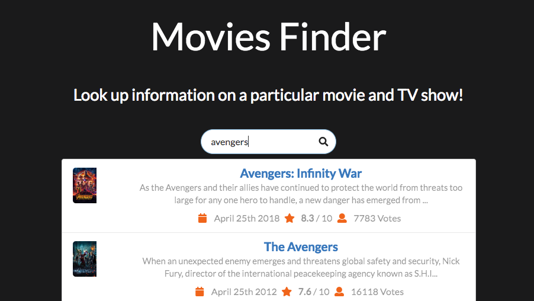

# Movies Finder

Movies Finder let you easily search for and discover movies and TV shows from popular sources like IMDB and The Movie Database (TMDb). You can find trending movies, entertainment news, and all wonderful details about a particular film.



**Demo:** [https://movies-finder-app.herokuapp.com](https://movies-finder-app.herokuapp.com)

See [screenshots](#Screenshots) for more photos.

The project is open source and all files are available on GitHub.

## Getting Started

In order to get a copy of the project up and running on your local machine for development and testing purposes, see the prerequisites below. Once completed, see deployment for notes on how to deploy the project on a live system.

### Prerequisites

You must have `Node` installed on your local machine prior to starting the development server.

```text
git clone https://github.com/naruthk/movies-finder-app
cd movies-finder-app
```

### Running the app

Start the project by running the command `npm start` or `yarn start` depending on which package manager you use.

Information about the site, such as the site's name (title), description, and navigation items are stored in a file called `config.js` within `src/utils` folder.

## Deployment

Run `npm build` or `yarn build` to compile and build all necessary scripts and assets.

## Screenshots

### Currently In Theaters


### Trending and Entertainment News


## Built With

* [React.js](https://github.com/facebook/react) - A JavaScript library for building user interfaces
* [Axios](https://github.com/axios/axios) - Promise based HTTP client
* [Semantic UI](https://react.semantic-ui.com) - User interface from Semantic UI

## To Do

- Create unit tests using Jest!
- Implement some HOC to create more reusable components
- Integrate a search bar at the top right of the navigation
- Connect with YouTube and Twitter API
- User authentication and account for saving favorite movies and tv shows

## Authors

* **Naruth Kongurai** - [naruthk.com](https://narutk.com)

See also the list of [contributors](https://github.com/naruthk/movies-finder-app/contributors) who participated in this project.

## License

This project is licensed under the MIT License - see the [LICENSE.md](LICENSE.md) file for details.
